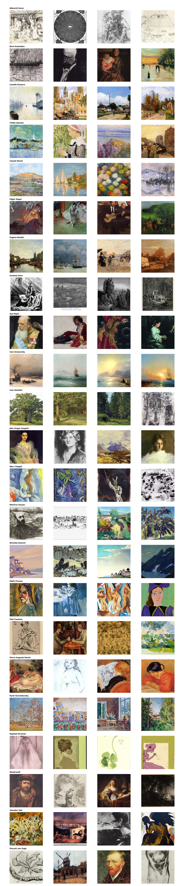
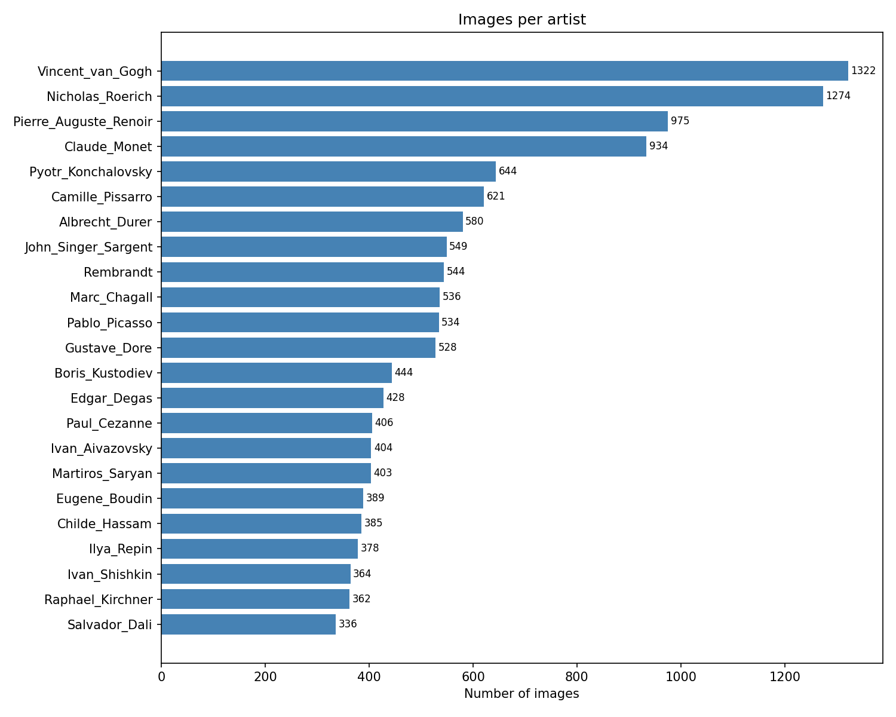
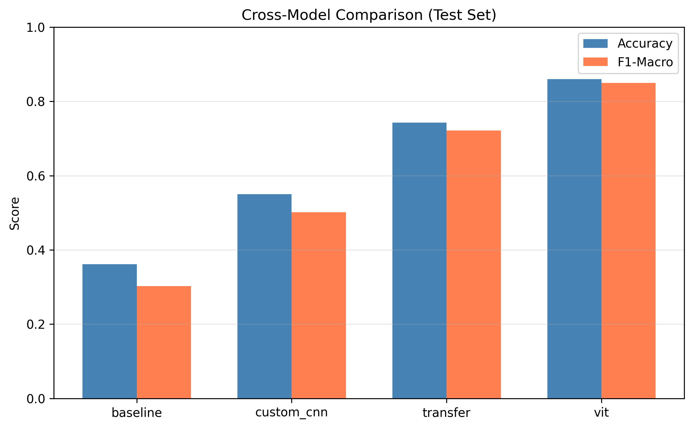
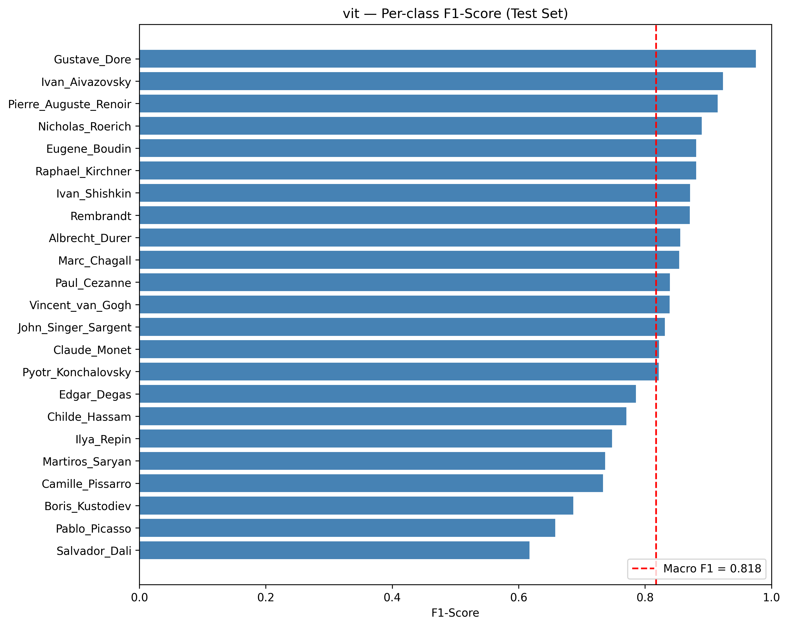
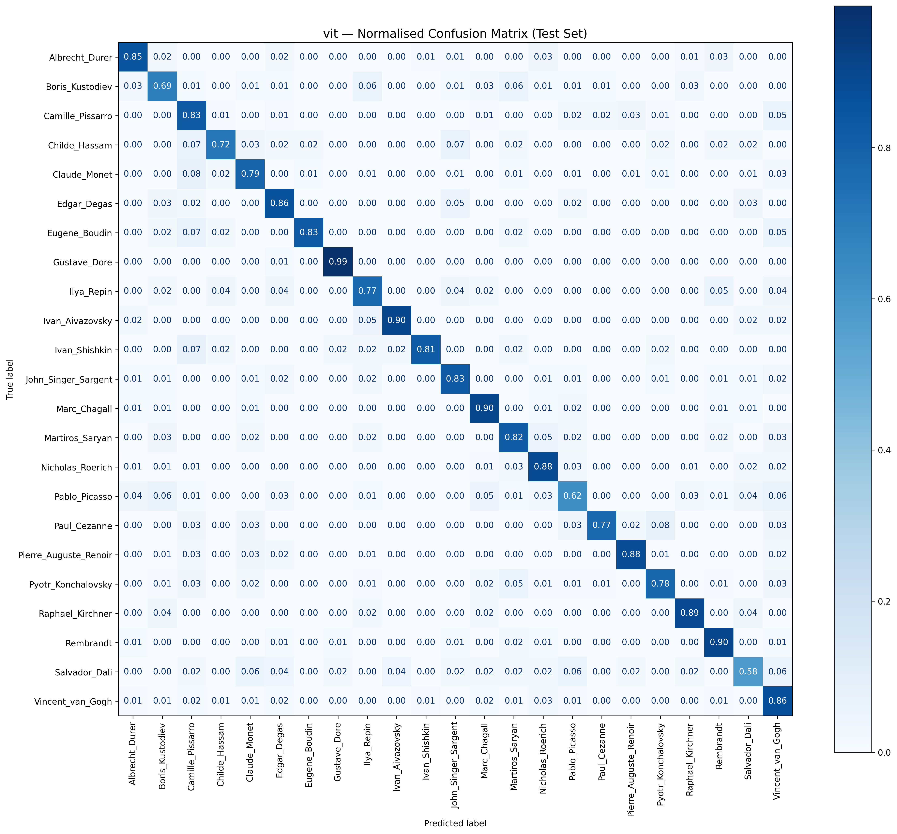
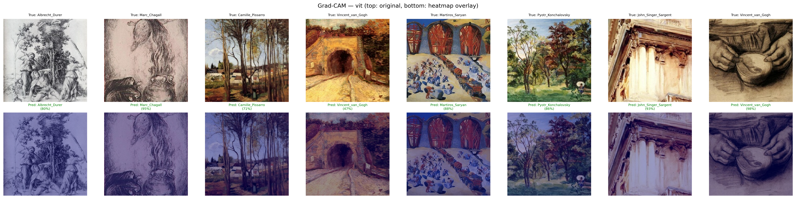
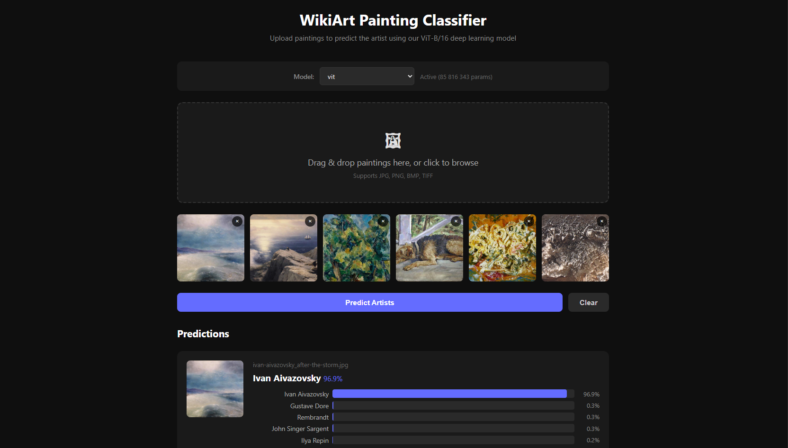
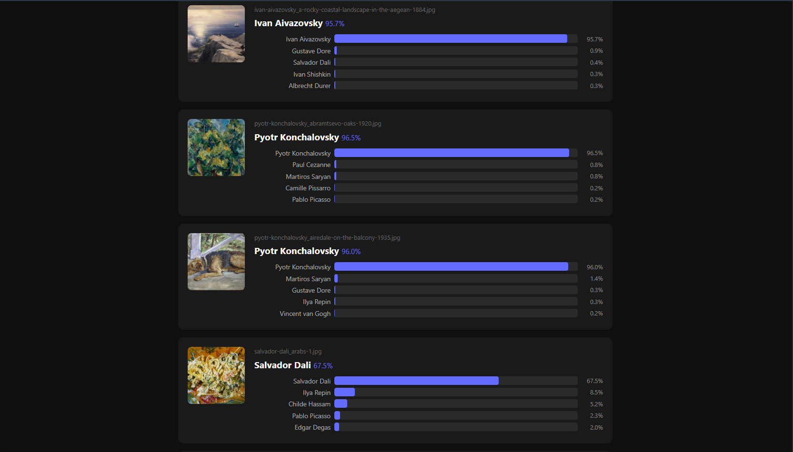
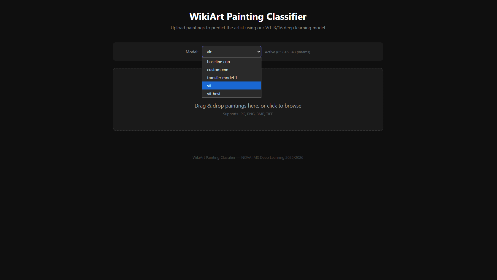

# 🎨 WikiArt Painting Classifier

A deep learning image classification system built on a subset of the **WikiArt** dataset, implemented in **Keras**. The project explores and compares multiple architectures — from custom CNNs and fine-tuned pretrained models to a Vision Transformer (ViT) — with a rigorous evaluation framework and Grad-CAM explainability analysis.

> 📄 **[Read the full report (PDF)](report/report.pdf)**

### Sample paintings from the dataset
<p align="center">
  
</p>

---

## 📁 Repository Structure

```
WikiArt-DeepLearning/
│
├── data/
│   ├── raw/                        # Original wikiart images (gitignored)
│   ├── processed/                  # Preprocessed & resized images
│   └── splits/                     # train.csv, val.csv, test.csv
│
├── notebooks/
│   ├── 01_eda.ipynb                # Exploratory data analysis
│   ├── 02_baseline_cnn.ipynb       # Baseline CNN
│   ├── 03_custom_cnn.ipynb         # Deeper custom CNN with hyperparameter tuning
│   ├── 04_transfer_learning.ipynb  # Transfer learning experiments (ResNet50)
│   ├── 05_vit.ipynb                # Vision Transformer fine-tuning
│   ├── 06_gradcam.ipynb            # Grad-CAM explainability analysis
│   └── 07_evaluation.ipynb         # Cross-model evaluation & error analysis
│
├── src/
│   ├── data_loader.py              # Dataset pipeline & augmentation
│   ├── models/
│   │   ├── baseline.py             # Shallow baseline CNN
│   │   ├── custom_cnn.py           # Deep custom CNN with BatchNorm + Dropout
│   │   ├── transfer.py             # Transfer learning (ResNet50)
│   │   └── vit.py                  # Vision Transformer (ViT-B/16)
│   ├── train.py                    # Shared training loop
│   ├── evaluate.py                 # Metrics, plots, confusion matrix
│   └── gradcam.py                  # Grad-CAM heatmap generation
│
├── app/
│   ├── server.py                   # Flask backend for prediction API
│   └── static/
│       └── index.html              # Web frontend with drag-and-drop upload
│
├── results/
│   ├── figures/                    # All plots and visualisations
│   ├── gradcam/                    # Grad-CAM heatmaps per class
│   ├── logs/                       # Training history CSVs
│   └── models/                     # Saved model checkpoints (.keras)
│
├── requirements.txt
├── README.md
└── .gitignore
```

> **Note:** The `data/raw/` and `data/processed/` folders are gitignored. Only the split CSVs in `data/splits/` are versioned. Both the **dataset** and **trained models** are available on **[Google Drive](https://drive.google.com/drive/folders/13It4uxPjX04n1Y3d-Inemh9AROe_Bsw8?usp=sharing)**:
> - Download the dataset `.zip`, extract it, and place the artist folders in `data/raw/`
> - Download the `.keras` model files and place them in `results/models/`

---

## 📊 Dataset

A curated subset of **WikiArt** with **13,340 paintings** across **23 artists**, ranging from Renaissance masters to modern painters.

<p align="center">
  
</p>

> Moderate class imbalance (3.9x ratio between largest and smallest class). F1-macro is used as the primary metric to account for this.

---

## 🚀 Getting Started

### 1. Clone the repository
```bash
git clone https://github.com/vehnie/WikiArt-DeepLearning.git
cd WikiArt-DeepLearning
```

### 2. Install dependencies
```bash
pip install -r requirements.txt
```

### 3. Prepare the data
Download the dataset `.zip` from [Google Drive](https://drive.google.com/drive/folders/13It4uxPjX04n1Y3d-Inemh9AROe_Bsw8?usp=sharing), extract it, and place the artist folders in `data/raw/` (e.g. `data/raw/Albrecht_Durer/`, `data/raw/Claude_Monet/`, ...). Then run the preprocessing script:
```bash
python src/data_loader.py --input data/raw/ --output data/processed/
```
This will resize images to 224x224 and generate the split CSVs in `data/splits/`.

### 4. Train a model
```bash
# Baseline CNN
python src/train.py --model baseline --epochs 30

# Custom CNN
python src/train.py --model custom_cnn --epochs 50

# Transfer learning (ResNet50)
python src/train.py --model transfer --epochs 20 --lr 1e-5 --dropout 0.5

# Vision Transformer (ViT-B/16 fine-tuned)
python src/train.py --model vit --epochs 20
```

### 5. Evaluate
```bash
python src/evaluate.py --model vit --checkpoint results/models/vit.keras
```

### 6. Generate Grad-CAM heatmaps
```bash
python src/gradcam.py --model vit --checkpoint results/models/vit.keras --output results/gradcam/
```

### 7. Launch the web app
```bash
python app/server.py
```
Open http://127.0.0.1:5000 — drag & drop paintings to predict the artist. Use the dropdown to switch between all trained models.

---

## 🏗️ Models Overview

### Baseline CNN
A shallow convolutional network (2 conv layers + dense head) used as a performance floor. Establishes the training pipeline and confirms data is loading correctly before more complex models are introduced.

### Custom CNN
A deeper architecture with 4 Conv blocks, Batch Normalisation, and Dropout, designed and tuned specifically for the WikiArt classification task. Hyperparameters optimised via Keras Tuner random search.

### Transfer Learning — ResNet50
Fine-tuned pretrained ResNet50 backbone with a custom classification head. Five experiments varying fine-tuning depth (5–10 layers), learning rate (1e-3, 1e-5), and dropout (0.4–0.6). Uses ImageNet preprocessing, EarlyStopping, ReduceLROnPlateau, and the shared augmentation pipeline.

### Vision Transformer — ViT-B/16
Fine-tuned pretrained Vision Transformer (ViT-B/16) with a custom classification head. The image is split into 16×16 patches, each treated as a token fed into multi-head self-attention blocks — allowing the model to capture long-range compositional relationships across a painting that CNNs inherently miss. Loaded via `keras-hub` from ImageNet-21K pretrained weights. Training uses AdamW with weight decay, cosine LR schedule with linear warmup, label smoothing, and an intermediate Dense(256, GELU) layer before the classifier.

---

## 📈 Results

All models are evaluated on the held-out test set (2,002 images) using accuracy, F1-macro, per-class metrics, normalised confusion matrices, and learning curves.

| Model | Accuracy | F1-Macro | Parameters |
|-------|----------|----------|------------|
| Baseline CNN | 36.1% | 30.1% | 6.8M |
| Custom CNN | 54.9% | 50.0% | 1.2M |
| Transfer Learning (ResNet50) | 74.5% | 72.2% | 25.6M |
| **ViT-B/16** | **86.0%** | **85.0%** | **85.8M** |

### Cross-Model Comparison
<p align="center">
  
</p>

### ViT-B/16 — Per-class F1 Score
<p align="center">
  
</p>

### ViT-B/16 — Normalised Confusion Matrix
<p align="center">
  
</p>

---

## 🔍 Explainability — Grad-CAM

Applied to the best-performing model (ViT-B/16). Grad-CAM computes the gradient of the predicted class score with respect to the final layer's feature maps, producing a heatmap that highlights which regions of a painting were decisive for the classification.

This is applied to:
- **Correct predictions** — confirming the model attends to semantically meaningful features (brushwork, composition, colour palette)
- **Misclassified samples** — diagnosing failure modes and potential dataset biases
- **Cross-class comparisons** — visualising what distinguishes, e.g., Impressionism from Post-Impressionism in the model's representation

Heatmaps are saved to `results/gradcam/` with naming convention `gradcam_<class>_<correct|wrong>_<id>.png`.

### Grad-CAM — Sample Overview
<p align="center">
  
</p>

---

## 🖥️ Web App — Interactive Classifier

A Flask-based web application for interactive artist prediction. Upload one or more paintings and get instant top-5 predictions with confidence scores.

**Features:**
- Drag-and-drop multi-image upload (JPG, PNG, BMP, TIFF)
- **Model selector** — switch between all trained models at runtime (Baseline CNN, Custom CNN, Transfer/ResNet50, ViT)
- Top-5 predictions per image with confidence bars
- Dark-themed responsive UI

**Run locally:**
```bash
python app/server.py                              # default: ViT model, port 5000
python app/server.py --model results/models/custom_cnn.keras --port 8080
```

<p align="center">
  <br>
  <em>Upload paintings and get instant predictions with confidence scores</em>
</p>

<p align="center">
  <br>
  <em>Batch predictions with top-5 artists per image</em>
</p>

<p align="center">
  <br>
  <em>Switch between all trained models at runtime</em>
</p>

---

## ⚙️ Requirements

Key dependencies (see `requirements.txt` for full list):

- `tensorflow >= 2.10`
- `keras`
- `keras-hub`             — ViT pretrained weights (ImageNet-21K)
- `keras-tuner`           — Hyperparameter search (Custom CNN)
- `flask`                 — Web app backend
- `numpy`
- `pandas`
- `matplotlib`
- `scikit-learn`
- `Pillow`

---

## 👥 Team

| Member | Contributions |
|--------|---------------|
| **Miguel Venancio** | Project lead, data pipeline, EDA, ViT fine-tuning, Grad-CAM, web app, repo management |
| **Goncalo Torrao** | Baseline CNN, custom CNN, hyperparameter tuning |
| **Anastasiia Shulha** | Transfer learning (ResNet50), fine-tuning experiments |
| **Leonor Ribeiro** | Evaluation framework, cross-model analysis, error analysis |
| **Henrique Serrao** | Report writing |

---

## 📄 License

Academic project — NOVA IMS Deep Learning course, 2025/2026.
